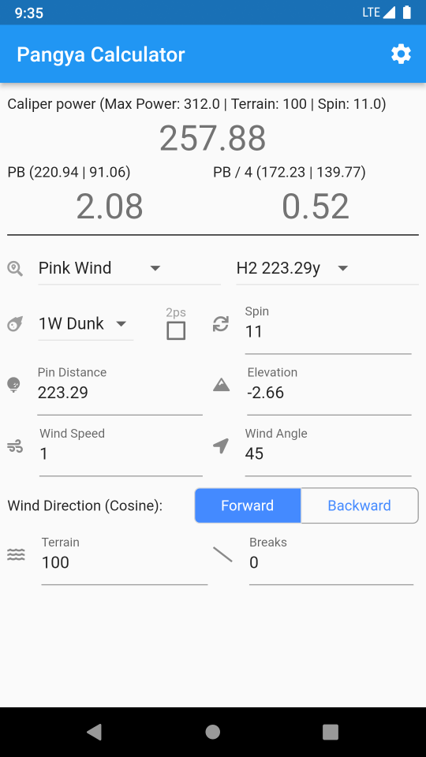

# Pangya Calculator

Android app to calculate the HWI and power needed to chip in. You will still need to get good in the game in order for this to be helpful though.

## Using the app
### Pre-setup
1. Click the gear icon to access the settings page
2. Key in your 1W normal, 1W tomahawk and 6i power

**Note**: The calculations works best for 1W power of 312y, 1W tomahawk of 330y and 6i of 152y. It gets less accurate the further you deviate from these values but will still allow you to chip in once you get the hang of making the minor adjustments. There are also minor idiosyncrasies so avoid crazy shots and bring lots of safeties.

### Calculating that chip in
1. Select the club and type of shot you want to use.
2. Key in the spin value (11 for backspin shots, 7 for tomahawks)
3. Key in the pin distance and elevation from the hole.
4. Key in the wind speed, angle and direction (A wind angle of 0 is for a cross wind while 90 is for a head/tail wind)
5. Key in the terrain value (e.g fairways tend to be 100)
6. Key in the number of break (This doesn't work well since the break formula is probably wrong)
7. Move left/right based on your choice of PB (powerbar when zoomed in all the way at the hole) or PB/4 (powerbar without any changes to the zoom level). The numbers in bracket indicate the caliper power to set to get the exact pb movement for the last click (left | right).
8. Set the caliper power to the value closest to the power stated
9. Hit "PangYa" and watch it fly in (or not)

## Installing the app
(Preferred) Clone the project. Install android studio and compile it from there.

or

Download the apk from the release page. (You really shouldn't install random apks from the web though)